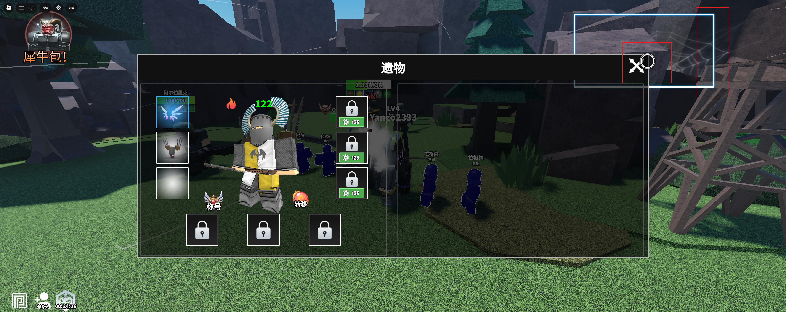
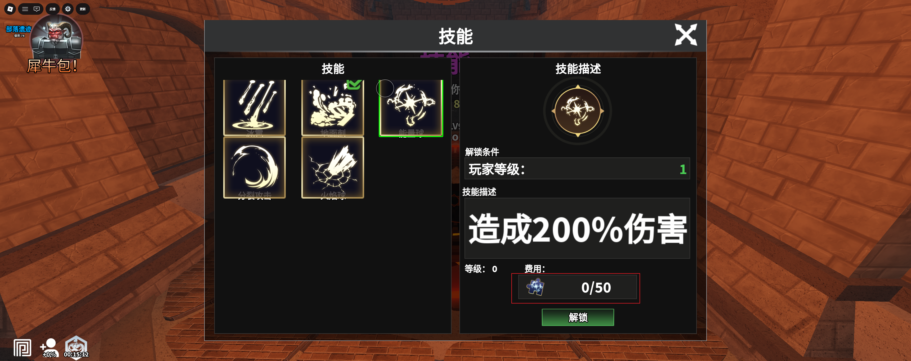
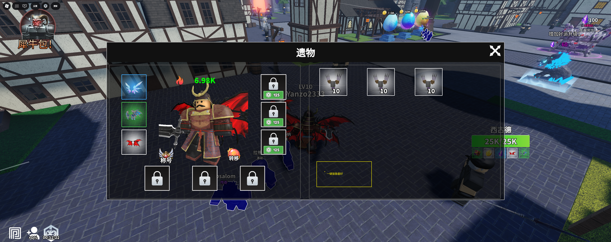
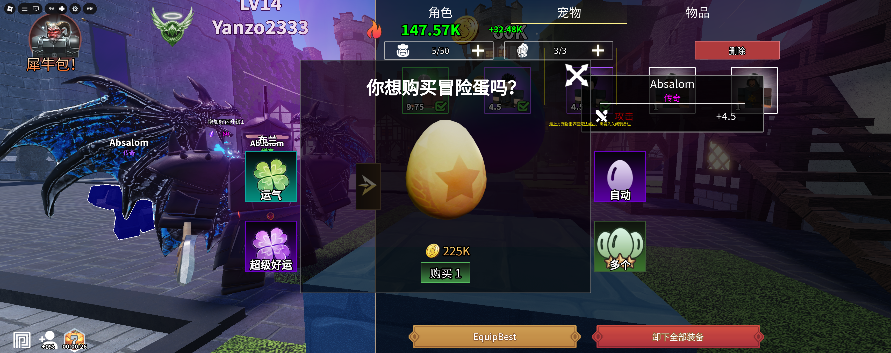

优化点
- [ ] 在不使用自动攻击的情况下，鼠标左键持续点击无法普通攻击，只能点一下攻击一下（鼠标和手柄都是）
- [ ] 手柄容易误触到背后的方框
- [ ] 我在哪里查看当前碎片数量
- [ ] 加个一键装备按钮呢
- [ ] 最外层界面无法先关闭
- [ ] 必须点显示才能使用技能，比较麻烦。显示后想要装备遗物必须点隐藏才能装备，想使用技能是还需要再点回来, 建议把技能也调成可以自动使用，cd一到就自动使用