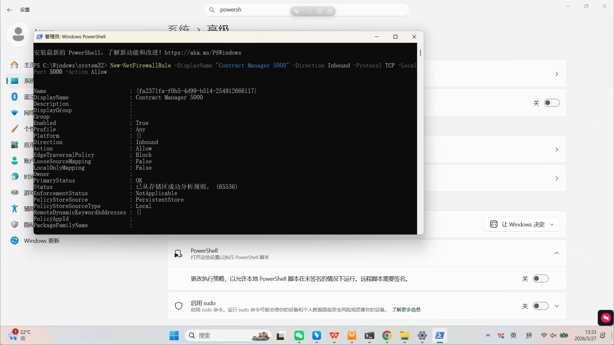

**精准格挡就是在“受伤前一瞬间，也就是命中结算点”做一次条件判断。**

不是并行真的同时发生，而是同一个结算流程里先判断状态，再决定伤害流向：

```text
敌人攻击命中 A
  |
  v
检查 A 的格挡状态
  |
  +-- 没格挡
  |     A 受到 100% 伤害
  |
  +-- 普通格挡
  |     A 受到 35% 伤害
  |
  +-- 精准格挡
        A 受到 0 伤害
        Enemy 受到反伤
```

`DamageMultiplier` 和 `ReflectMultiplier` 只是把这个结果数字化：

```text
没格挡：
DamageMultiplier = 1
ReflectMultiplier = 0

普通格挡：
DamageMultiplier = 0.35
ReflectMultiplier = 0

精准格挡：
DamageMultiplier = 0
ReflectMultiplier = 1
```

所以最后统一计算：

```text
A 实际受伤 = 原始伤害 * DamageMultiplier
Enemy 反伤 = 原始伤害 * ReflectMultiplier
```

你说的“受伤前一瞬间计算”非常准确。只是程序里这个“一瞬间”就是：

```text
服务器准备扣血之前的那一行代码
```

也就是：

```text
先算防御结果
再决定扣谁的血
```

这套结构好处是很清楚：

```text
攻击负责产生命中
护盾负责返回防御结果
伤害系统负责最终扣血/反伤
```

你可以把它当成一个战斗系统标准模板。




