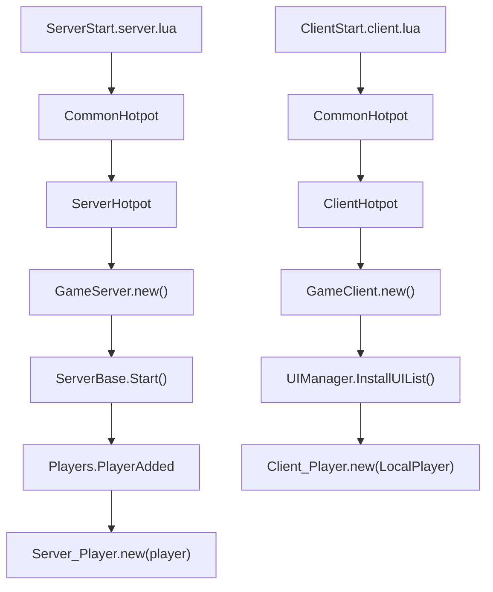
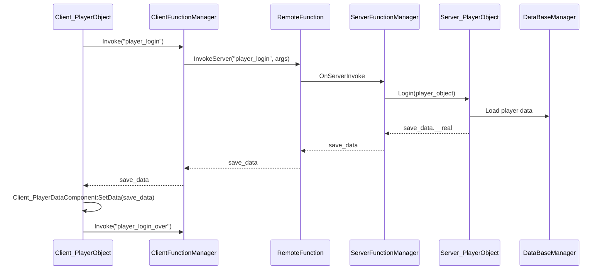
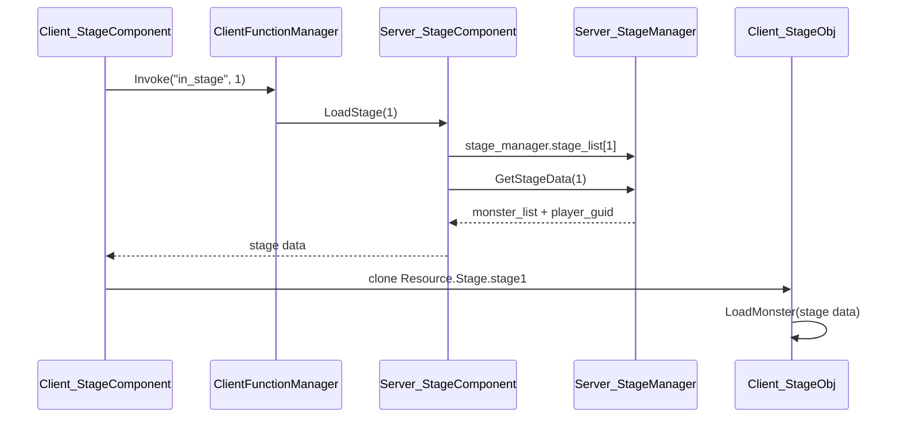
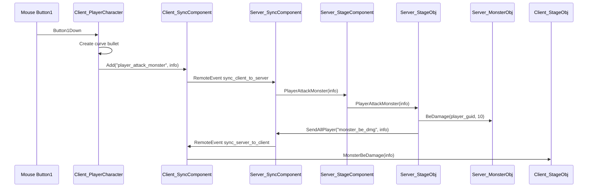

# Roblox 项目接手开发文档

扫描目录：`D:\SVN`  
扫描日期：2026-05-27  
目标：帮助新接手者快速掌握项目结构、启动链路、核心玩法、数据与配置流、风险点和后续学习顺序。

## 1. 先给结论

这个项目不是一个单独的 Roblox Studio `.rbxl` 二进制项目，而是一个混合工程：

- `place/CaseProject.rbxl`：Studio 场景文件，里面大概率保存了 `Resource`、`Stage`、UI 预制体、怪物模型、特效等非源码资源。
- `default.project.json` + `src/`：Rojo 同步源码，负责把脚本、Remote、配置 Lua 同步进 Studio。
- `config/*.xlsx` + `makedata/` + `assist/`：Excel 配置导出和 FileList 生成工具链。
- `src/ReplicatedStorage/Hotpot`、`src/ServerStorage/Hotpot`：项目使用的自研框架，命名为 Hotpot。
- `.svn` 和 `.git` 同时存在：目录名叫 SVN，也确实有 `.svn` 工作副本信息，但本机当前没有 `svn` 命令；同时根目录是 Git 仓库且有大量未提交/未跟踪内容。

当前源码更像一个“从较大框架/项目裁剪出来的战斗 Demo 或初始项目”。主链路是：玩家进入游戏 -> 登录读取存档 -> 生成玩家对象和角色对象 -> 自动进入 stage1 -> 客户端克隆场景和怪物表现 -> 鼠标发射子弹攻击怪物 -> 客户端同步请求给服务器 -> 服务器扣怪物血 -> 服务器广播表现给客户端。

但项目还没到“完整可维护成品”的状态。源码中已经能看到多处未完成或从旧项目残留的引用，例如缺失的 `prop_cmp`、`skill_cmp`、`teleport_gui`、`stageDrop`、`normalRewards` 等。接手时应该先跑通最小闭环，再修复这些断点。

## 2. 已验证的本地环境状态

本次扫描验证到：

| 项目 | 状态 |
| --- | --- |
| 当前目录 | `D:\SVN` |
| Rojo | 已安装，`rojo --version` 返回 `Rojo 7.6.1` |
| Aftman | 已安装，`aftman 0.3.0` |
| `aftman.toml` | 项目声明 `rojo-rbx/rojo@7.4.0-rc2`，与本机实际 Rojo 版本不一致 |
| `lua` 命令 | 未安装或不在 PATH |
| `svn` 命令 | 未安装或不在 PATH |
| `stylua` | 已安装，`stylua 2.4.1` |
| `selene` | 已安装，`selene 0.30.0` |
| Rojo sourcemap | `rojo sourcemap default.project.json --output ...` 成功 |
| Git 状态 | 根仓库有大量修改、删除、未跟踪文件；Hotpot、makedata 等子目录也有独立 Git 状态 |

注意：`run_all.bat` 和 `reload.bat` 都会调用 `lua ./assist/reload.lua`，但本机当前没有 `lua` 命令，所以这部分工具链直接运行会失败。配置导出部分使用 `makedata/bin.exe`，但 FileList 生成依赖 Lua + `lfs`。

## 3. 根目录结构说明

| 路径 | 作用 |
| --- | --- |
| `default.project.json` | Rojo 项目映射，定义 Roblox 服务和 `src` 文件夹的同步关系 |
| `place/CaseProject.rbxl` | Roblox Studio 场景文件，源码无法直接完整读取，需要 Studio 打开验证 |
| `src/ReplicatedFirst` | 客户端最早执行入口，目前只有 `ClientStart.client.lua` |
| `src/ServerScriptService` | 服务端入口，目前只有 `ServerStart.server.lua` |
| `src/ReplicatedStorage` | 客户端可见共享内容：Hotpot Common/Client、配置、Remote、客户端业务脚本 |
| `src/ServerStorage` | 服务端专用内容：Hotpot Server、服务端业务脚本、服务端 FileList |
| `src/ReplicatedStorage/_FileData` | 自动生成的客户端和通用模块路径索引 |
| `src/ServerStorage/_FileData` | 自动生成的服务端模块路径索引 |
| `src/ReplicatedStorage/Config` | Excel 导出的 Lua 配置 |
| `config` | Excel 原始配置表 |
| `config_desc` | 导表描述文件，目前实际描述很少，多数表为空描述块 |
| `makedata` | 导表工具和依赖 |
| `assist` | 辅助脚本，主要是生成 FileList 和配置注释 |
| `api` | Roblox API/LSP 辅助库，不是业务代码 |
| `.vscode/tasks.json` | VS Code 任务，提供 Rojo serve 和 sourcemap |

源码规模大致如下：

| 区域 | Lua 文件数 | 行数 |
| --- | ---: | ---: |
| `src/ReplicatedStorage/Hotpot/Common` | 69 | 12055 |
| `src/ReplicatedStorage/Hotpot/Client` | 22 | 2468 |
| `src/ServerStorage/Hotpot/Server` | 20 | 2641 |
| `src/ReplicatedStorage/Script` | 20 | 3011 |
| `src/ServerStorage/Script` | 14 | 1101 |
| `src/ReplicatedStorage/Config` | 22 | 1556 |

## 4. Rojo 映射和 Studio 运行方式

`default.project.json` 把源码同步到 Roblox DataModel：

| Roblox 服务 | 本地路径 |
| --- | --- |
| `ReplicatedFirst` | `src/ReplicatedFirst` |
| `ReplicatedStorage` | `src/ReplicatedStorage` |
| `ServerScriptService` | `src/ServerScriptService` |
| `ServerStorage` | `src/ServerStorage` |
| `StarterPlayer.StarterCharacterScripts` | `src/StarterPlayer/StarterCharacterScripts` |
| `StarterPlayer.StarterPlayerScripts` | `src/StarterPlayer/StarterPlayerScripts` |

每个服务上都设置了 `$ignoreUnknownInstances: true`。这很重要：Rojo 同步源码时，不会删除 Studio 场景里已有但不在 `src` 里的对象。项目里大量资源路径依赖 `ReplicatedStorage.Resource`、`Resource.Stage`、`Resource.ui`、`Resource.monster` 等，但这些目录不在 `src` 中，因此它们应该在 `place/CaseProject.rbxl` 里。

推荐运行流程：

1. 用 Roblox Studio 打开 `place/CaseProject.rbxl`。
2. 在项目根目录执行：
   ```powershell
   rojo serve default.project.json --address 127.0.0.1 --port 34872
   ```
3. 在 Roblox Studio 的 Rojo 插件中连接 `127.0.0.1:34872`。
4. Play Solo，观察 Output。

不要用空白 Baseplate 直接连接这个 Rojo 项目，因为源码里没有 `Resource` 和场景预制体，直接跑大概率会缺资源。

## 5. 启动链路

### 5.1 服务端启动

入口：`src/ServerScriptService/ServerStart.server.lua`

执行顺序：

1. `LoadFrame("Common")`：从 `ReplicatedStorage.Hotpot.Common.CommonHotpot` 加载通用框架。
2. `LoadFrame("Server")`：从 `ServerStorage.Hotpot.Server.ServerHotpot` 加载服务端框架。
3. `ServerHotpot.load.GameServer().new()` 创建游戏服务端对象。
4. `server:Start()` 启动玩家监听、关闭保存、玩家对象创建等逻辑。
5. `_G.GameAnalyticsServiceInit = CommonHotpot.load.GameAnalyticsServerInit()` 初始化 GameAnalytics。

服务端关键对象：

| 对象 | 文件 | 责任 |
| --- | --- | --- |
| `ServerHotpot` | `src/ServerStorage/Hotpot/Server/ServerHotpot.lua` | 初始化服务端框架、FileList、配置、事件/函数管理器 |
| `GameServer` | `src/ServerStorage/Script/Server/Object/GameServer.lua` | 游戏服务端根对象，创建 `Server_StageManager` |
| `ServerBase` | `src/ServerStorage/Hotpot/Server/Object/ServerBase.lua` | 玩家进入/退出、BindToClose、DataStore 保存等待 |
| `Server_Player` | `src/ServerStorage/Script/Server/Object/Server_Player.lua` | 项目自己的服务端玩家类 |
| `Server_PlayerObject` | `src/ServerStorage/Hotpot/Server/Object/Server_PlayerObject.lua` | 框架层玩家登录、角色生成、客户端角色通知 |

### 5.2 客户端启动

入口：`src/ReplicatedFirst/ClientStart.client.lua`

执行顺序：

1. `LoadFrame("Common")`：加载通用框架。
2. `LoadFrame("Client")`：加载客户端框架。
3. `ClientHotpot.load.GameClient().new()` 创建游戏客户端对象。
4. `client:Start()` 调用 `GameClient:OnStart()`。
5. `GameClient:OnStart()` 安装 UI，然后创建本地玩家对象。

客户端关键对象：

| 对象 | 文件 | 责任 |
| --- | --- | --- |
| `ClientHotpot` | `src/ReplicatedStorage/Hotpot/Client/ClientHotpot.lua` | 初始化客户端框架、FileList、配置、事件/函数管理器、Resource |
| `GameClient` | `src/ReplicatedStorage/Script/Client/Object/GameClient.lua` | 客户端根对象，安装 UI，创建本地玩家 |
| `ClientBase` | `src/ReplicatedStorage/Hotpot/Client/Object/ClientBase.lua` | 本地玩家生命周期、客户端 event/function 延迟处理 |
| `Client_Player` | `src/ReplicatedStorage/Script/Client/Object/Client_Player.lua` | 项目自己的客户端玩家类 |
| `Client_PlayerObject` | `src/ReplicatedStorage/Hotpot/Client/Object/Client_PlayerObject.lua` | 登录、存档接收、角色对象创建 |

### 5.3 启动链路图



## 6. Hotpot 框架核心机制

这个项目的 `require` 不是直接到处写完整路径，而是通过 Hotpot 框架动态加载。

### 6.1 FileList 名称表

三个文件是自动生成的：

- `src/ReplicatedStorage/_FileData/CommonFileList.lua`
- `src/ReplicatedStorage/_FileData/ClientFileList.lua`
- `src/ServerStorage/_FileData/ServerFileList.lua`

它们把短名称映射到 Roblox 实例路径，例如：

```lua
c.GameClient = "ReplicatedStorage.Script.Client.Object.GameClient"
c.Server_StageManager = "ServerStorage.Script.Server.Module.Server_StageManager"
c.Client_SyncComponent = "ReplicatedStorage.Hotpot.Client.Component.Client_SyncComponent"
```

框架用法：

```lua
local hotpot = _G.ClientHotpot
local stage_obj = hotpot.load.Client_StageObj()
```

`hotpot.load.Client_StageObj()` 的本质是：

1. 查 `ClientFileList.Client_StageObj`。
2. 通过 `HotpotFrame:GetPath_Loop()` 找到对应 ModuleScript。
3. `require`。
4. 缓存 require 结果。

如果你新增或重命名模块，必须重新生成 FileList，否则 `hotpot.load.Xxx()` 找不到新类。

生成脚本是 `assist/reload.lua`，但本机当前没有 `lua` 命令，需要先处理工具链。

### 6.2 Class 继承

类系统在 `src/ReplicatedStorage/Hotpot/Common/Class.lua`：

```lua
local c = hotpot.class.new(script, hotpot.files.BaseObject())
```

规则：

- `script.Name` 作为类名。
- 第二个参数是父类 ModuleScript。
- `c.new(...)` 通常返回 `c(...)`。
- `c(...)` 会创建对象并调用 `c:ctor(...)`。
- 父类通过 `c.super` 访问。

接手时要记住：这里不是原生 Luau class，而是框架自定义 metatable class。

### 6.3 对象生命周期

| 类 | 文件 | 作用 |
| --- | --- | --- |
| `BaseObject` | `Hotpot/Common/Object/BaseObject.lua` | 注册对象、AddProcess/AddUpdate、Wait、事件监听、全局消息 |
| `GameObject` | `Hotpot/Common/Object/GameObject.lua` | 绑定 Roblox Instance，提供组件系统 |
| `ModelObject` | `Hotpot/Common/Object/ModelObject.lua` | 封装 Model 的位置、CFrame、PrimaryPart、缩放等 |
| `CharacterObject` | `Hotpot/Common/Object/CharacterObject.lua` | 封装 Humanoid、死亡回调、移动/血量属性 |
| `BaseComponent` | `Hotpot/Common/Component/BaseComponent.lua` | 挂到父对象 `__components` 的组件基类 |

组件挂载方式：

```lua
self.stage_cmp = self:AddComponent(hotpot.load.Client_StageComponent())
```

内部会按类名写入：

```lua
parent.__components[self.class] = self
```

所以同一个父对象上同类组件只能有一个。

## 7. 网络通信结构

项目只有三个主要通信对象，全部在 `src/ReplicatedStorage`：

| 对象 | 类型 | 用途 |
| --- | --- | --- |
| `RemoteEvent.rbxmx` | `RemoteEvent` | 常规客户端/服务端事件 |
| `RemoteFunction.rbxmx` | `RemoteFunction` | 客户端/服务端 RPC |
| `LoginFunction.rbxmx` | `RemoteFunction` | 登录阶段发放简单校验码 |

### 7.1 RemoteEvent

客户端管理器：`src/ReplicatedStorage/Hotpot/Client/Module/ClientEventManager.lua`  
服务端管理器：`src/ServerStorage/Hotpot/Server/Module/ServerEventManager.lua`

调用方式：

```lua
-- 客户端发给服务端
hotpot.event_manager:Fire("start_block")

-- 服务端注册处理
hotpot.event_manager:RegistHandle("start_block", function(player_object)
end)
```

事件实际传输格式：

```text
RemoteEvent:FireServer(event_name, args)
RemoteEvent:FireClient(player, event_name, ...)
```

框架会把 table 的数字 key 转成字符串发送，再转回来。这是为了适配 Roblox Remote 对 table key 的限制。

### 7.2 RemoteFunction

客户端管理器：`src/ReplicatedStorage/Hotpot/Client/Module/ClientFunctionManager.lua`  
服务端管理器：`src/ServerStorage/Hotpot/Server/Module/ServerFunctionManager.lua`

调用方式：

```lua
-- 客户端
local data = hotpot.function_manager:Invoke("player_login")

-- 服务端
hotpot.function_manager:SetHandle("player_login", c.Login)
```

`EventList.lua` 和 `FunctionList.lua` 并不是真正的枚举配置，它们是“传入什么 key 就返回什么 key”的 metatable：

```lua
function meta:__index(key)
    return key
end
```

所以 `function_list.player_login` 实际就是字符串 `"player_login"`。

### 7.3 登录通信链路



登录完成后，服务端 `Server_PlayerObject:LoginOver()` 会监听 `CharacterAdded`。角色出现后，服务端创建 `Server_PlayerCharacter`，再通过事件 `server_player_character` 通知客户端创建 `Client_PlayerCharacter`。

## 8. 数据和存档

初始数据在 `src/ServerStorage/Script/Server/Module/PlayerData.lua`：

```lua
{
    version = 0,
    regist_time = os.time(),
    stage = { list = {[1] = true} },
    prop = { exp = 0, lv = 1, gold = 0 },
    bag = {
        potion = { inst_id = 0, list = {}, max_capacity = 10 },
        material = { list = {}, max_capacity = 30 },
        weapon = { list = {}, now_equip = 0 },
    },
    skill = { list = {} },
}
```

服务端存档组件：`src/ServerStorage/Hotpot/Server/Component/Server_PlayerDataComponent.lua`

主要逻辑：

1. 用 `DataBaseManager:Load("player_data", user_id)` 读取 DataStore。
2. 没有数据则使用 `PlayerData.GetInitData()`。
3. 用 `ProxyNode.new(save_data)` 包一层代理。
4. 业务修改必须放进 `save_data:Execut(function() ... end)`。
5. 修改后如果 `ProxyNode:Isdirty()`，则保存到 DataStore。

客户端存档组件：`src/ReplicatedStorage/Hotpot/Client/Component/Client_PlayerDataComponent.lua`

客户端拿到的是服务端登录时返回的一份数据快照。后续如果服务端改数据，需要通过事件或同步组件通知客户端，否则客户端本地不会自动知道。

注意事项：

- Studio 测试 DataStore 需要在 Game Settings 开启 Studio API Services。
- `DataBaseManager` 有请求预算和保存队列，退出时 `ServerBase:BindToClose()` 会等待保存完成。
- 客户端不能被视为权威数据源。

## 9. 配置系统

原始配置表在 `config/*.xlsx`，当前包括：

| Excel | 生成 Lua 目录 | 作用 |
| --- | --- | --- |
| `stage.xlsx` | `src/ReplicatedStorage/Config/stage` | 关卡配置 |
| `monster.xlsx` | `src/ReplicatedStorage/Config/monster` | 怪物配置 |
| `skill.xlsx` | `src/ReplicatedStorage/Config/skill` | 技能配置 |
| `potion.xlsx` | `src/ReplicatedStorage/Config/potion` | 药水配置 |
| `audio.xlsx` | `src/ReplicatedStorage/Config/audio` | 音频配置 |
| `collider_group.xlsx` | `src/ReplicatedStorage/Config/collider_group` | 碰撞组配置 |
| `DictMain.xlsx`、`DictTranslate.xlsx`、`DictExtend.xlsx` | `Localization` / 翻译流程 | 多语言相关 |

生成后的总入口是：

```lua
local config = require(ReplicatedStorage.Config)
config.stage
config.monster
config.skill
config.potion
```

目前配置摘要：

- `stage`：只有一个关卡 `id=1`，模型名 `stage1`，名称 `Blackwater Cove`。
- `monster`：分 9 个 Lua chunk，包含多个怪物，第一批 id 1-8 是 stage1 怪物，其中 id 8 是 boss。
- `skill`：5 个技能配置，客户端当前只默认装配了 skill 1 到 E 键。
- `potion`：2 个药水，中文名称为“冰锥术药水”“火球术药水”。
- `audio`：分 2 个 chunk，包含 bgm、攻击、boss、ui 等音频 id。

Windows 侧批处理：

| 文件 | 作用 | 当前注意点 |
| --- | --- | --- |
| `run_all.bat` | reload -> 导表 -> 翻译 export/pull/merge -> 再导表 -> config_mark | 开头和结尾依赖 `lua` |
| `reload.bat` | 只跑 `assist/reload.lua` | 依赖 `lua` |
| `config_export.bat` | 运行 `makedata/bin.exe -b main.lua` 导表 | 后面调用 `config_mark` 可能有路径问题 |
| `translation_*.bat` | 翻译表流程 | 依赖 `makedata/bin.exe` |

接手规则：

- 改 Excel 后再生成 Lua，不建议直接改 `src/ReplicatedStorage/Config` 下的生成文件。
- 新增/重命名业务 Lua 模块后要跑 `assist/reload.lua` 生成 `_FileData`。
- 目前本机没有 `lua`，要先补工具链，否则 FileList 无法可靠更新。

## 10. 核心玩法链路

### 10.1 玩家进入和自动进入关卡

关键文件：

- `src/ReplicatedStorage/Script/Client/Object/Client_Player.lua`
- `src/ServerStorage/Script/Server/Object/Server_Player.lua`
- `src/ReplicatedStorage/Script/Client/Component/Client_StageComponent.lua`
- `src/ServerStorage/Script/Server/Component/Server_StageComponent.lua`

客户端玩家创建后：

1. `Client_PlayerObject:Login()` 获取服务端存档。
2. `Client_Player:ctor()` 调用 `getPlayerGuid` 获取服务端分配的 guid。
3. `Client_Player:LoadComponent()` 添加：
   - `Client_SyncComponent`
   - `Client_StageComponent`
   - `Client_BagComponent`
   - `Client_SkillComponent`
4. `Client_Player:OnCharacterIn()` 中自动执行 `self.stage_cmp:LoadStage(1)`。

服务端玩家登录后：

1. `Server_PlayerObject:Login()` 添加：
   - `Server_PlayerDataComponent`
   - `Server_PayLogComponent`
2. `Server_Player:OnLogin()` 添加：
   - `Server_SyncComponent`
   - `Server_StageComponent`
   - `Server_BagComponent`

### 10.2 进入 stage1



服务端 `Server_StageManager` 启动时会从 `hotpot.Resource.Stage` 找配置里的 stage 模型。客户端 `Client_StageComponent` 会从 `_G.Resource.Stage.stage1` 克隆场景，并挂到 `workspace.Stage`。

这说明 `.rbxl` 场景里必须存在：

- `ReplicatedStorage.Resource`
- `Resource.Stage.stage1`
- `Resource.monster`
- `workspace.Stage`

这些资源不在源码里，需要 Studio 验证。

### 10.3 鼠标普通攻击

关键文件：

- 客户端角色：`src/ReplicatedStorage/Script/Client/Object/Client_PlayerCharacter.lua`
- 客户端同步：`src/ReplicatedStorage/Hotpot/Client/Component/Client_SyncComponent.lua`
- 服务端同步：`src/ServerStorage/Hotpot/Server/Component/Server_SyncComponent.lua`
- 服务端关卡组件：`src/ServerStorage/Script/Server/Component/Server_StageComponent.lua`
- 服务端关卡对象：`src/ServerStorage/Script/Server/Object/Server_StageObj.lua`
- 服务端怪物：`src/ServerStorage/Script/Server/Object/Server_MonsterObj.lua`
- 客户端关卡表现：`src/ReplicatedStorage/Script/Client/Object/Client_StageObj.lua`
- 客户端怪物表现：`src/ReplicatedStorage/Script/Client/Object/Client_MonsterObj.lua`

流程：



普通攻击目前是固定伤害 `10`，在 `Server_StageObj:PlayerAttackMonster()` 写死。

安全问题：客户端发送了 `monster_guid`、`stage_id`、`player_guid`，服务端只校验 stage 和 guid 是否存在，没有校验距离、攻击冷却、子弹轨迹、命中合法性。这在公开 Roblox 游戏里容易被 exploit。

### 10.4 格挡

按键：`F`

客户端：

- `Client_PlayerCharacter:BindMouse()` 绑定 `ContextActionService:BindAction("Block", ...)`
- 按下 F：`hotpot.event_manager:Fire("start_block")`
- 松开 F：`hotpot.event_manager:Fire("stop_block")`

服务端：

- `Server_PlayerCharacter.lua` 注册 `start_block` 和 `stop_block`
- `StartBlock()` 设置 `self.__block = true`，并让玩家身上的 `BlockValue` 为 true
- `StopBlock()` 延迟 0.3 秒关闭

表现：

- 服务端创建 `Shiled` 球形 ForceField Part，透明度用于显示/隐藏。
- 客户端监听 `BlockValue.Changed`，把当前怪物攻击提示标记为 block。

### 10.5 技能

客户端技能入口：`src/ReplicatedStorage/Script/Client/Component/Client_SkillComponent.lua`

当前逻辑：

- 绑定 E 键和 R 键。
- 构造时只执行 `self:AddSkill(1, "E")`。
- 所以当前默认只有 E 键有技能，R 键没有技能对象。

技能文件：

- `Client_Skill_1.lua`：Hail，当前 `SendDamage()` 内容被注释，基本只播表现。
- `Client_Skill_2.lua` 到 `Client_Skill_5.lua`：有伤害发送逻辑，会调用 `stage:PlayerSkill(...)` 或发送 `pk_skill_dmg` / `pvp_skill`。

服务端技能伤害入口：

- `Server_StageComponent:PlayerSkillMonster(info)`
- `Server_StageObj:PlayerSkillMonster(info)`

当前风险很高：`Server_StageObj:PlayerSkillMonster()` 调用了：

```lua
player.prop_cmp:GetAttack()
player.skill_cmp:GetSkillPer(info.slot)
```

但 `Server_Player:LoadComponent()` 没有添加 `prop_cmp` 和 `skill_cmp`，而且现有 `Server_PropComponent` 没有 `GetAttack()` / `GetLv()`，`Server_SkillComponent` 没有 `GetSkillPer()`。因此技能伤害链路目前不是完整可用状态。

### 10.6 怪物

服务端怪物：`Server_MonsterObj`

职责：

- 生成服务端 guid。
- 从 `hotpot.config.monster[id]` 读取 hp、attack、is_boss 等。
- 管理 hp、受击、死亡、恢复、移动广播。
- 死亡后调用 `stage:MonsterDie()`，再销毁服务端对象。

客户端怪物：`Client_MonsterObj`

职责：

- 克隆模型并放到关卡的 `monster` 文件夹。
- 设置碰撞组和 collider。
- 创建血条、锁定高亮、受击高亮、死亡动画。
- 播放怪物动画和移动表现。

当前怪物攻击逻辑不完整：

- `Server_MonsterObj:Attack()` 里构造了 `players` 表，但 `player_guid` 没有从表里选值，后面 `local player = self.stage.guid_to_player[player_guid]` 基本会拿到 nil。
- 客户端 `Client_MonsterObj:CheckDmg()` 会在动画 marker 时向服务端发送 `monster_atk_player`，但这依赖怪物已经进入攻击动画和目标跟随。

## 11. UI 系统

UI 安装入口：`src/ReplicatedStorage/Hotpot/Client/Module/UIManager.lua`

UI 列表：`src/ReplicatedStorage/Script/Client/Module/UIList.lua`

当前实际安装的 UI：

```lua
c.bag_gui = hotpot.load.BagGui()
c.hud_gui = hotpot.load.HudGui()
```

存在但未安装的 UI 类：

- `IndexGui`
- `LoadingGui`
- `TipsGui`
- `UpdateLogGui`（Hotpot Client 里）

`BagGui` 依赖资源路径：

- `Resource.ui.BagGui`
- `Resource.Potion`

`HudGui` 依赖资源路径：

- `Resource.ui.HudGui`

注意：`TipsGui` 里用的是 `hotpot:GetPath("UI.TipsGui", hotpot.resource)`，大小写是 `UI`，而其他 UI 用 `ui`。需要在 Studio 中确认资源目录到底是 `UI` 还是 `ui`。

当前 UI 断点：

- `Client_StageComponent` 调用了 `ui_manager.ui_list.tips_gui`、`teleport_gui`，但 `UIList.lua` 没有安装这些 UI。
- `Client_StageObj` 调用了 `HudGui:SetBossProgress()`、`SetBossPanelVisible()` 等方法，但当前 `HudGui.lua` 没有这些方法。

这说明 UI 层还残留了旧项目代码，当前最小 UI 应该只以 `BagGui` 和 `HudGui` 为准。

## 12. 背包和药水

服务端：`src/ServerStorage/Script/Server/Component/Server_BagComponent.lua`

功能：

- `AddPotion(potion_id, purity)`：给玩家增加药水，写入存档，并通过事件 `add_potion` 通知客户端。
- `EquipPotion(inst_id)`：装备药水，最多 3 个。
- 注册 RemoteFunction：`equipPotion`。

客户端：`src/ReplicatedStorage/Script/Client/Component/Client_BagComponent.lua`

功能：

- 从 `self.parent.save_data:GetData("bag")` 读背包数据。
- 初始化 `BagGui`。
- 点击药水项展示右侧详情。
- 点击装备按钮调用 `equipPotion`。

未完成：

- `ClickPotionRightUnequipBtn()` 只是 `print`。
- `ClickPotionRightUseBtn()` 只是 `print`。
- 装备成功后只改 UI 按钮，没有同步本地 `potion_data.equip = true`，后续状态可能不一致。

## 13. 支付、排行、GM、分析

Hotpot 框架里保留了一些系统：

| 系统 | 文件 | 当前判断 |
| --- | --- | --- |
| 支付 | `Server_PayManager.lua`、`Client_PayManager.lua`、`ProductsEventManager.lua` | 框架存在，但当前项目业务没有明显接入 |
| 支付日志 | `Server_PayLogComponent.lua` | 登录时会挂到玩家 |
| 排行 | `Server_RankManager.lua`、`RankList.lua`、`Server_PlayerRankComponent.lua` | 框架存在，当前业务几乎未用 |
| GM 命令 | `ServerStorage/Script/Server/Module/GMCommand.lua` | `GameServer` 构造时加载 |
| GameAnalytics | `Hotpot/Common/Module/GA/*`、`GAConfig.lua` | 服务端启动时初始化 |

这些不是第一阶段接手重点。先跑通核心玩法，再决定是否保留或移除。

## 14. 已发现的高风险问题

这些不是猜测，是从源码直接扫描到的。

### 14.1 `ServerFunctionManager:Invoke()` 服务端调用客户端函数路径有明显 bug

文件：`src/ServerStorage/Hotpot/Server/Module/ServerFunctionManager.lua`

问题：

- `send_active_list[player_object]` 没有初始化就被索引。
- `local result remote_function:InvokeClient(...)` 实际不会把返回值赋给 `result`，后面 `ConvertToGet(result)` 会拿到 nil。

影响：

- 只要服务端主动 `function_manager:Invoke(player_object, function_name, ...)` 调客户端函数，就可能失败。
- 当前主链路主要是客户端 InvokeServer，所以不一定启动即炸，但这是框架层风险。

### 14.2 `Server_PlayerObject` 有 assert 拼写错误和角色字段不一致

文件：`src/ServerStorage/Hotpot/Server/Object/Server_PlayerObject.lua`

问题：

```lua
local assert = asser
```

`asser` 未定义，所以本文件内局部 `assert` 是 nil。

另外：

```lua
function c:SetServerCharacter(class_name)
    self.attribute.server_character_name = class_name
end

function c:GetServerCharacter()
    return self.attribute.server_character_class or "Server_PlayerCharacter"
end
```

设置写入 `server_character_name`，读取却读 `server_character_class`。

影响：

- 默认角色类还能走，因为 `GetServerCharacter()` 有 fallback。
- 但如果以后想动态切换服务端角色类，会失败。
- 调用 `SetServerCharacter()` / `SetClientCharacter()` 时会因为 `assert` nil 报错。

### 14.3 服务端属性/技能组件缺失

文件：

- `src/ServerStorage/Script/Server/Object/Server_Player.lua`
- `src/ServerStorage/Script/Server/Component/Server_StageComponent.lua`
- `src/ServerStorage/Script/Server/Object/Server_StageObj.lua`
- `src/ServerStorage/Script/Server/Component/Server_PropComponent.lua`
- `src/ServerStorage/Script/Server/Component/Server_SkillComponent.lua`

问题：

- `Server_Player:LoadComponent()` 只添加 `sync_cmp`、`stage_cmp`、`bag_cmp`。
- 但是 `UnlockStage()` 调用了 `self.parent.prop_cmp:GetLv()`。
- 技能伤害调用了 `player.prop_cmp:GetAttack()` 和 `player.skill_cmp:GetSkillPer()`。
- `Server_PropComponent` 目前只有 `GetGold/AddGold/CostGold`，没有 `GetLv/GetAttack`。
- `Server_SkillComponent` 目前只有构造函数，没有 `GetSkillPer`。

影响：

- 解锁关卡链路会报错。
- 技能伤害链路会报错。

### 14.4 客户端关卡组件引用大量缺失系统

文件：`src/ReplicatedStorage/Script/Client/Component/Client_StageComponent.lua`

缺失或未安装引用：

- `self.parent.prop_cmp`
- `self.parent.shop_cmp`
- `self.parent.task_cmp`
- `ui_manager.ui_list.teleport_gui`
- `ui_manager.ui_list.tips_gui`
- `hotpot.config.relics`
- `hotpot.config.stageDrop`
- `normalRewards`
- `HudGui:SetBossPanelVisible`
- `HudGui:SetBossProgress`
- `HudGui:AddItemInBossRewards`
- `HudGui:SetPartyBtnVisible`

影响：

- `LoadStage(1)` 基础进入可能不触发这些路径。
- 但传送、boss 区域、锁关、提示相关功能会断。

### 14.5 客户端关卡对象引用旧活动/天气系统

文件：`src/ReplicatedStorage/Script/Client/Object/Client_StageObj.lua`

缺失引用：

- `christmasMonsterCfg`
- `weatherCfg`
- `weatherFol`

影响：

- 普通 stage1 怪物可能正常。
- 触发圣诞/天气怪路径会报错。

### 14.6 技能 1 没有实际发送伤害

文件：`src/ReplicatedStorage/Script/Client/Object/Skill/Client_Skill_1.lua`

`SendDamage()` 内容被注释：

```lua
function c:SendDamage(list)
    -- ...
end
```

影响：

- 当前默认 E 键装的是 skill 1。
- E 键大概率只播表现，不会造成伤害。

### 14.7 怪物攻击目标选择不完整

文件：`src/ServerStorage/Script/Server/Object/Server_MonsterObj.lua`

`Attack()` 里声明了 `local player_guid`，但没有从候选玩家中赋值。后面：

```lua
local player = self.stage.guid_to_player[player_guid]
if not player then
    return
end
```

影响：

- 服务端怪物主动攻击可能不会发生。

### 14.8 Remote 安全校验基本被注释掉

文件：

- `ClientEventManager.lua`
- `ServerEventManager.lua`
- `ClientFunctionManager.lua`
- `ServerFunctionManager.lua`
- `EncryptionManager.lua`

`EncryptionManager` 仍然存在，`LoginFunction` 也还会发 code，但 event/function manager 里的 encode/decode 校验基本都被注释。

影响：

- 客户端可以直接发事件名和参数。
- 服务端当前对普通攻击过于信任客户端。
- 如果要上线，必须把关键行为改成服务端权威校验。

### 14.9 版本控制状态混乱

当前根 Git 状态显示大量修改和未跟踪文件，且 `.gitmodules` 被删除，子模块路径又有独立 Git 仓库。`git submodule status` 显示多个子模块前面是 `-`，说明根仓库认为它们没有按子模块方式初始化到位。

影响：

- 接手前必须先和同事确认“以 SVN 为准、以 Git 为准，还是两个都只是临时同步产物”。
- 在未确认前不要做大规模重命名或自动格式化。

## 15. 当前最小可玩闭环判断

在 `.rbxl` 资源完整的前提下，理论上最小闭环是：

1. 服务端/客户端 Hotpot 启动。
2. 玩家登录，读取或创建存档。
3. 客户端创建本地玩家和组件。
4. 角色生成后进入 stage1。
5. 客户端克隆 stage1 和怪物表现。
6. 鼠标左键发射曲线子弹。
7. 命中 monster collider 后同步 `player_attack_monster`。
8. 服务端扣怪物 10 点血。
9. 服务端广播 `monster_be_dmg`。
10. 客户端显示伤害和血条变化。

这个闭环需要在 Studio 里实际验证，因为关键资源在 `place/CaseProject.rbxl` 里，源码无法直接读取。

预计不完整的功能：

- 技能伤害。
- 关卡解锁/传送。
- boss 奖励 UI。
- 药水使用/卸下。
- 怪物主动攻击。
- 反作弊/服务端权威校验。
- 支付/排行/活动/天气/PVP 相关残留路径。

## 16. 接手学习路线

建议按下面顺序学，不要一开始全盘读 Hotpot。

### 第 1 阶段：掌握启动和加载机制

阅读顺序：

1. `default.project.json`
2. `src/ServerScriptService/ServerStart.server.lua`
3. `src/ReplicatedFirst/ClientStart.client.lua`
4. `src/ReplicatedStorage/Hotpot/Common/CommonHotpot.lua`
5. `src/ReplicatedStorage/Hotpot/Client/ClientHotpot.lua`
6. `src/ServerStorage/Hotpot/Server/ServerHotpot.lua`
7. `_FileData/*.lua`

你要能回答：

- 为什么 `hotpot.load.GameClient()` 能找到文件？
- 为什么新增文件后必须更新 `_FileData`？
- `CommonHotpot`、`ClientHotpot`、`ServerHotpot` 各负责什么？

### 第 2 阶段：掌握对象和组件

阅读顺序：

1. `Class.lua`
2. `BaseObject.lua`
3. `GameObject.lua`
4. `BaseComponent.lua`
5. `PlayerObject.lua`
6. `Client_PlayerObject.lua`
7. `Server_PlayerObject.lua`
8. `Client_Player.lua`
9. `Server_Player.lua`

你要能回答：

- `ctor/dtor` 什么时候调用？
- `AddProcess/AddUpdate` 和 Roblox 原生事件有什么区别？
- 一个组件如何挂到玩家对象上？
- `instance_manager:FindObject(player_inst)` 为什么能找到玩家对象？

### 第 3 阶段：追一条完整玩法链路

先追普通攻击，不要先追技能。

阅读顺序：

1. `Client_PlayerCharacter.lua`
2. `Client_SyncComponent.lua`
3. `Server_SyncComponent.lua`
4. `Server_StageComponent.lua`
5. `Server_StageObj.lua`
6. `Server_MonsterObj.lua`
7. `Client_StageComponent.lua`
8. `Client_StageObj.lua`
9. `Client_MonsterObj.lua`

你要能画出：

```text
鼠标点击
-> 客户端创建子弹
-> 子弹碰到 monster collider
-> Client_SyncComponent:Add("player_attack_monster")
-> RemoteEvent
-> Server_SyncComponent
-> Server_StageComponent
-> Server_StageObj
-> Server_MonsterObj:BeDamage
-> Server_SyncComponent 广播
-> Client_StageObj 更新表现
```

### 第 4 阶段：掌握数据和配置

阅读顺序：

1. `PlayerData.lua`
2. `Server_PlayerDataComponent.lua`
3. `DataBaseManager.lua`
4. `ProxyNode.lua`
5. `src/ReplicatedStorage/Config/init.lua`
6. `config/*.xlsx`
7. `assist/reload.lua`
8. `assist/config_mark.lua`

你要能回答：

- 新玩家初始数据在哪里定义？
- 为什么服务端改存档要通过 `save_data:Execut()`？
- Excel 配置如何变成 `hotpot.config.monster`？
- 新增 ModuleScript 后为什么要更新 FileList？

### 第 5 阶段：修补断点

建议修复顺序：

1. 明确版本控制基线，确认是否以当前工作区为准。
2. 补齐本地工具链：Lua/SVN 或替换批处理脚本。
3. 在 Studio 中跑一次，保存 Output 报错。
4. 修 `ServerFunctionManager:Invoke()`。
5. 修 `Server_PlayerObject` 的 `assert` 和角色字段。
6. 决定技能/属性系统是补全还是先禁用。
7. 清理 `Client_StageComponent` 和 `Client_StageObj` 的旧系统引用。
8. 把普通攻击改成更严格的服务端校验。

## 17. 开发修改守则

1. 新增或重命名 Lua 模块后，必须更新 `_FileData`。
2. 不要直接相信客户端传来的 guid、stage_id、part、damage。
3. 生成配置优先改 Excel，不直接改生成 Lua。
4. 改 UI 之前先确认 `Resource.ui` 里的真实层级。
5. 改怪物或关卡之前先确认 `Resource.Stage.stage1` 和 `Resource.monster` 的真实结构。
6. 改 DataStore 前先在 Studio 测试新玩家、老玩家、退出保存三个场景。
7. 不要一次混改框架和业务，Hotpot 是全项目基础层，影响面大。
8. 在版本控制基线未确认前，不要格式化全仓库。

## 18. 下一步必须在 Studio 中验证的内容

源码无法直接完整读取 `.rbxl`，所以这些需要打开 `place/CaseProject.rbxl`：

- `ReplicatedStorage.Resource` 是否存在。
- `Resource.Stage.stage1` 结构：是否有 `spawn`、`monster`、`monsterPos`。
- `Resource.monster` 是否包含配置表中 `model` 对应的模型名。
- `Resource.pfb` 是否包含 `bullet`、`newhitEff`、`monsterHp`、`collider`、`AimGui`、`LightingGui`、`dmgUi`。
- `Resource.ui.HudGui` 和 `Resource.ui.BagGui` 层级是否和代码 `GetInst()` 一致。
- `workspace.Stage` 是否存在。
- 角色是否能收到 `BlockValue`。
- Output 是否出现 `prop_cmp`、`skill_cmp`、`teleport_gui`、`tips_gui`、`SetBossProgress` 等错误。

如果要做第二轮深度接手，建议从 Studio 导出 Explorer 树和关键 Resource 结构，再补一份“资源/场景结构文档”。

## 19. 最小验收清单

接手后先用这张清单判断项目是否真正跑通：

- [ ] `rojo serve default.project.json --address 127.0.0.1 --port 34872` 能启动。
- [ ] Studio 能连接 Rojo。
- [ ] Play Solo 无启动级红错。
- [ ] 玩家进入后能创建 `Server_Player` 和 `Client_Player`。
- [ ] 玩家角色生成后自动进入 stage1。
- [ ] stage1 能克隆到 `workspace.Stage`。
- [ ] 怪物能显示模型和血条。
- [ ] 鼠标左键能发射子弹。
- [ ] 子弹命中怪物后服务端扣血。
- [ ] 怪物死亡后客户端表现正常。
- [ ] 10 秒后怪物能复活。
- [ ] F 键格挡能切换 `BlockValue` 和护盾表现。
- [ ] E 键技能预期明确：如果只播表现，也要记录为当前已知状态。
- [ ] 退出时 DataStore 保存没有持续报错。

## 20. 给接手者的核心心智模型

这个项目可以按四层理解：

```text
Studio 资源层
    place/CaseProject.rbxl 中的 Resource、Stage、UI、模型、特效

框架层 Hotpot
    class、object lifecycle、component、event/function、DataStore、UI base

业务层 Script
    GameClient/GameServer、Player、Stage、Monster、Bag、Skill

配置层 Config
    Excel -> Lua -> hotpot.config
```

真正开发时，任何功能通常都会跨这四层。例如“新增一个怪物”不是只改一处：

1. `config/monster.xlsx` 增加配置。
2. 导出到 `src/ReplicatedStorage/Config/monster`。
3. Studio 资源里放入对应模型。
4. stage 的 `monsterPos` 放置刷怪点。
5. 服务端 `Server_StageObj` 根据刷怪点 id 读配置。
6. 客户端 `Client_StageObj` 根据配置克隆模型。
7. `Client_MonsterObj` 绑定 collider、血条、动画。

所以接手时不要只看 Lua，也不要只看 Studio。这个项目的真实状态必须用“源码 + 配置 + Studio 资源”一起判断。
