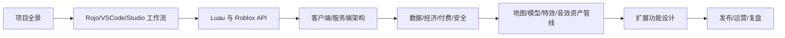
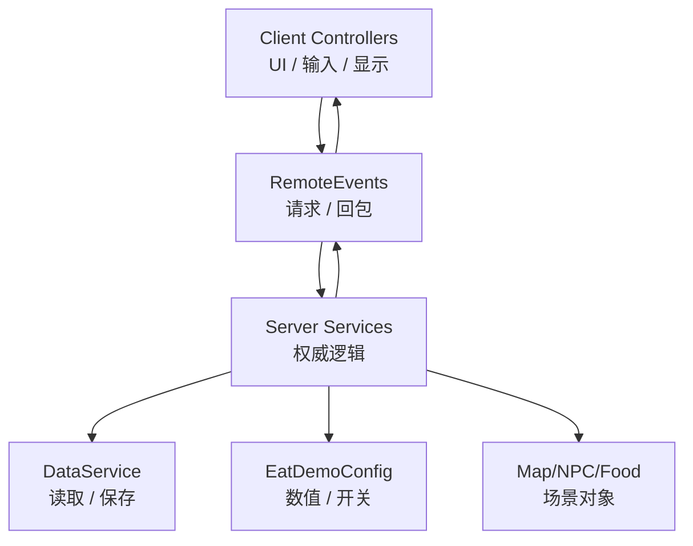

先暂停推进。现在目标改成：**用这个项目把你训练成能独立做 Roblox 游戏的人**。不是继续堆功能，而是把项目拆成教材、练习场和作品集。

**总路线**
我建议分成 8 个阶段，每个阶段都用当前项目里的真实文件学习，不讲空理论。



**阶段 1：先看懂这个项目**
目标：你能说清楚每个目录、每个核心文件负责什么。

重点文件：

| 位置 | 你要掌握什么 |
|---|---|
| `Replica_Demo_RojoKnit/default.project.json` | Rojo 如何把本地文件映射到 Roblox Studio |
| `src/ReplicatedStorage/Shared/EatDemoConfig.luau` | 全局配置、数值、开关、版本边界 |
| `src/ReplicatedStorage/Shared/RemoteNames.luau` | 客户端和服务端通信名称 |
| `src/ServerScriptService/EatDemoServer.server.luau` | 服务端启动入口 |
| `src/ServerScriptService/Services/*.luau` | 玩法、数据、商品、NPC、地图等服务层 |
| `src/StarterPlayer/StarterPlayerScripts/EatDemoClient.client.luau` | 客户端启动入口 |
| `src/StarterPlayer/StarterPlayerScripts/ClientModules/*.luau` | UI、按钮、反馈、扫描、商店等客户端控制器 |
| `Project_Analysis_Package/*.md` | 每个版本为什么做、怎么测、边界是什么 |
| `Tools/*.luau` | Studio 导出、地图烘焙、辅助工作流 |

练习：你先能画出“点击按钮 -> Remote -> Server -> 数据变化 -> UI 回包”的路径。

**阶段 2：掌握 Rojo + VSCode + Studio 工作流**
目标：你知道什么时候在 VSCode 改，什么时候在 Studio 改。

原则：

```text
代码、配置、文档：VSCode + Git 管。
场景对象、模型摆放、灯光、材质、碰撞检查：Roblox Studio 管。
稳定地图：可以用脚本生成一次，再烘焙进 Studio。
测试：Studio Play 先测逻辑，Roblox Player 测真实购买 / DataStore / 客户端。
```

你需要掌握这些命令：

```powershell
rojo serve Replica_Demo_RojoKnit/default.project.json
rojo sourcemap Replica_Demo_RojoKnit/default.project.json --output Replica_Demo_RojoKnit/sourcemap.json
stylua Replica_Demo_RojoKnit/src
stylua --check Replica_Demo_RojoKnit/src
git status
git diff
git log --oneline
```

**阶段 3：Luau 和 Roblox 编程基础**
目标：不是“会写语法”，而是能读懂项目里的真实代码。

学习顺序：

1. Luau 基础：table、function、module、local、return。
2. Roblox Instance：Part、Model、Folder、RemoteEvent、Bindable、Player、Character。
3. 事件模型：`.Touched`、`.OnServerEvent`、`.Changed`、`PlayerAdded`。
4. 服务：`Players`、`ReplicatedStorage`、`ServerStorage`、`MarketplaceService`、`DataStoreService`。
5. Tween、Debounce、Cooldown、RateLimit。
6. 服务端权威：钱、肌肉、奖励、购买、惩罚都必须服务端算。

练习：读懂 `EatService`、`NpcService`、`ProductService` 三条链路。

**阶段 4：游戏架构**
你这个项目目前已经有一个不错的学习架构：



你要掌握的架构规则：

```text
客户端只负责显示和发请求。
服务端负责判断是否合法。
配置集中在 EatDemoConfig。
每个系统一个 Service。
每个 UI 模块一个 Controller。
新功能先画闭环，再写代码。
高风险功能先加开关，默认关闭。
```

**阶段 5：数据结构、经济、付费、安全**
这是独立开发者最容易翻车的部分。

你需要重点掌握：

| 主题 | 项目里的对应内容 |
|---|---|
| 玩家状态 | Muscle、Money、FoodCore |
| 临时状态 | NPC failure、revive pending、cooldown |
| 持久化 | DataService、DataStoreName、AutoSave |
| 商品 | ProductService、Developer Product receipt |
| 防重复 | receiptId、failureId、pending intent |
| 经济曲线 | 食物奖励、NPC 强度、失败惩罚、复活价值 |
| 安全 | 客户端不能直接加钱、不能直接发奖励 |

练习：你能解释为什么“购买成功”不能只靠客户端按钮判断。

**阶段 6：模型、素材、特效、音效怎么补**
当前短板确实是美术资产：模型、特效、音效都还是工程占位。解决方法不是一次性全换，而是建立资产管线。

推荐顺序：

1. **先换食物模型**  
   食物是最多、最容易提升观感的资产。先做汉堡、披萨、苹果、鸡腿、金币、礼盒 6 类低多边形模型。

2. **再换 NPC 模型**  
   第一版不要直接做复杂怪物 rig。先用 Roblox R15 / 简单 Humanoid 模型 + 配色 + 头顶信息 + 缩放，等玩法稳定后再接自定义 rig。

3. **再补 VFX**  
   吃食物、NPC 吞噬、复活、奖励、VIP 门、升级，都可以用 `ParticleEmitter`、`Beam`、`Trail`、`Highlight`、`TweenService` 做轻量效果。

4. **最后补音效**  
   先做 10 个核心 SFX：吃东西、金币、按钮、转盘、礼盒、NPC 靠近、吞噬、失败、复活、购买成功。

具体资产流程：

```text
需求表
-> 找参考图
-> 生成/购买/自制模型
-> Blender 或第三方工具清理
-> 导出 FBX / GLTF / OBJ
-> Roblox Studio 3D Importer 导入
-> 检查大小、碰撞、材质、性能
-> 得到 AssetId
-> 写进配置或 Studio 对象
-> 小范围测试
```

Roblox 官方支持通过 3D Importer 导入模型、图片、声音和视频，也支持 FBX / GLTF / OBJ 等格式；自定义音频可以通过 Asset Manager / Creator Dashboard 上传，Creator Store 也有可用音频资源。Rojo 适合把本地文件作为代码源同步到 Studio，但场景和资产仍然需要你在 Studio 里检查。

**阶段 7：AI 工作流**
你以后和 AI 协作，不应该说“帮我做个功能”，而应该这样提需求：

```text
目标：
玩家点击转盘，消耗金币，获得奖励。

边界：
不改 DataStore schema。
不接真实 Robux。
不影响 NPC 和 PvP。

验收：
按钮能点。
金币不足提示。
奖励由服务端发。
Studio Play 待我测试。

输出：
更新 handoff、测试说明、Next_Steps。
运行 stylua / rojo sourcemap。
```

AI 最适合帮你做：

```text
读代码、找链路、写小版本、补文档、生成测试清单、分析报错、重构模块、写工具脚本。
```

你必须自己掌握：

```text
游戏好不好玩。
美术风格要什么。
付费价格是否合理。
真实资产版权。
Roblox 后台发布和商品配置。
玩家反馈怎么取舍。
```

**阶段 8：真正成为独立开发者的训练节奏**
我建议用 12 周训练法：

| 周期 | 主题 | 产出 |
|---|---|---|
| 第 1 周 | 项目结构 + Rojo 工作流 | 你能独立同步、运行、提交 |
| 第 2 周 | Luau / Roblox API | 你能读懂一个 Service |
| 第 3 周 | 客户端 UI / Controller | 你能改一个面板 |
| 第 4 周 | Remote / 服务端校验 | 你能做一个安全按钮闭环 |
| 第 5 周 | DataStore / 存档 | 你能解释保存边界 |
| 第 6 周 | Developer Product | 你能解释 receipt 流程 |
| 第 7 周 | NPC / AI 行为 | 你能调 NPC 行为节奏 |
| 第 8 周 | 地图 / 区域 / 刷新 | 你能设计一个新区域 |
| 第 9 周 | 模型资产管线 | 你能导入并替换食物模型 |
| 第 10 周 | VFX / SFX | 你能做一套基础反馈效果 |
| 第 11 周 | 游戏经济 / 留存 | 你能做数值表和回归测试 |
| 第 12 周 | 发布 / 运营 | 你能独立发 Beta 并复盘 |

**我建议下一步不是写功能，而是建学习资料包**
下一轮我可以不改游戏逻辑，只在项目里新增一套学习文档：

```text
Project_Learning/
01_Project_Map.md
02_Rojo_VSCode_Studio_Workflow.md
03_Client_Server_Remote_Flow.md
04_Data_And_Economy.md
05_Product_And_Receipt.md
06_NPC_AI_Architecture.md
07_Asset_Pipeline_Model_VFX_SFX.md
08_AI_Collaboration_Workflow.md
09_Independent_Developer_Roadmap.md
```

然后我们从 `01_Project_Map.md` 开始，每次只学一个主题：我讲项目真实代码，你照着做一个小练习，最后你自己复述链路。这样你不是“看我做项目”，而是逐步接管项目。

参考：
[Roblox 3D Importer](https://create.roblox.com/docs/art/modeling/3d-importer)、[Roblox 自定义 3D 资产](https://create.roblox.com/docs/art/modeling)、[Roblox 音频资产](https://create.roblox.com/docs/audio/assets)、[Roblox 外部工具 / Rojo 工作流](https://create.roblox.com/docs/projects/external-tools)、[Rojo Sync Details](https://rojo.space/docs/v7/sync-details/)、[Roblox Effects](https://create.roblox.com/docs/effects)