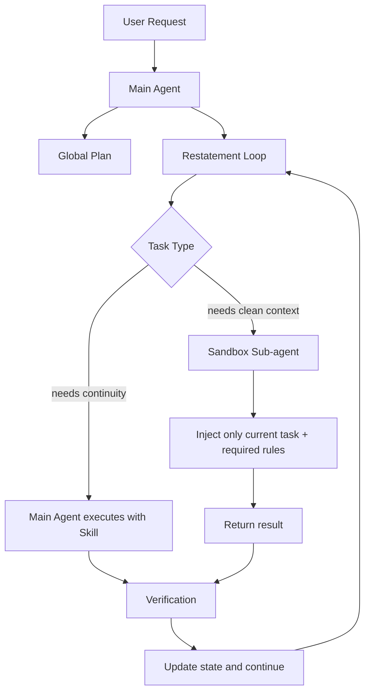

# AI Agent 架构演进学习笔记版

## 这份笔记怎么用

这份笔记适合用来快速理解原文，不追求复述所有细节，而是帮助你抓住主线、术语和工程判断方法。

建议阅读顺序：

1. 先看“一句话总览”和“架构演进地图”。
2. 再看“核心术语卡片”，建立概念框架。
3. 最后用“自测问题”检查自己是否真正理解。

## 一句话总览

AI Agent 架构不是越复杂越好。真正有效的设计，应当根据真实问题选择合适的上下文组织方式：需要连续记忆时减少不必要的 Sub-agent，需要防止历史干扰时再用 Sub-agent 做上下文隔离。

## 架构演进地图

| 阶段 | 架构形态 | 想解决的问题 | 暴露的新问题 | 最重要的结论 |
| --- | --- | --- | --- | --- |
| 第一代 | Plan and Execute + 多 Sub-agent | 让主 Agent 规划，子 Agent 执行，职责清晰 | 小改动也要走完整流程，通信成本高，主 Agent 容易越权 | Plan and Execute 更像工作方式，不一定要做成物理多层架构 |
| 第二代 | 单 Agent + Skill 注入 | 减少多 Agent 通信，让上下文保持连续 | 小任务表现好，但长任务开始失控 | Skill 的价值在于减少上下文搬运，不是因为它本身神奇 |
| 长任务阶段 | 单 Agent + To-Do List / Memory | 让 Agent 记住进度，持续执行上百步 | 中后期赶工、规则失效、输出同质化 | 只在开头给计划没用，关键规则要反复拉回最近上下文 |
| 第三代 | Restatement + 动静分离 Prompt | 对抗注意力衰退和 KV Cache 成本问题 | 能稳住规则，但不能解决创意同质化 | 静态规则放 System Prompt，动态进度放最近消息 |
| 最终形态 | 主 Agent 调度 + 沙盒 Sub-agent | 避免历史输出污染新任务 | 需要更明确的上下文选择和边界设计 | Sub-agent 的核心价值从“职责分层”变成“上下文隔离” |

## 核心术语卡片

### 1. Plan and Execute

含义：先规划，再执行。

常见误解：必须拆成一个 Planner Agent 和多个 Executor Agent。

更准确的理解：它首先是一种工作流程或思考方式。是否要拆成多个 Agent，要看工程成本和上下文传递是否值得。

### 2. Sub-agent

含义：由主 Agent 派生或调用的子 Agent，用来完成某类具体任务。

第一代问题：为了分层而分层，会造成通信复杂、上下文丢失、Token 成本上升。

最终价值：不是“职责看起来更清楚”，而是提供物理级上下文隔离，让子任务不被历史内容污染。

### 3. Skill

含义：动态提示词注入。系统在某个任务阶段，把对应的能力规则注入给当前 Agent。

本质：不是唤醒一个新 Agent，而是临时改变当前 Agent 的工作模式。

优势：减少主 Agent 与子 Agent 之间的信息搬运，保留上下文连续性。

### 4. Context Alignment

含义：上下文对齐。多个 Agent 协作时，需要确保每个 Agent 看到的信息一致、完整、没有误解。

风险：用户图片、搜索结果、历史决策、代码上下文等信息在多 Agent 之间转移时，容易丢失或变形。

工程启发：多 Agent 架构的难点不只是“怎么分工”，而是“怎么保证它们理解的是同一个任务”。

### 5. Long-running Task

含义：长运行任务。例如连续生成上百段代码、上百帧视频、长时间执行复杂流程。

典型问题：

- 中后期开始跳步骤。
- 规则逐渐失效。
- 输出越来越重复。

核心原因：上下文变长后，模型对不同位置的信息关注度不均衡。

### 6. Restatement

含义：重申机制。在每个关键步骤前，重新告诉模型当前进度、下一步目标和必须遵守的规则。

关键理解：这不是废话，而是工程控制手段。

作用：把重要信息重新放回最近上下文，让模型重新“看见”它。

### 7. KV Cache

含义：大模型推理时为了节省计算，会缓存已经处理过的上下文结果。

工程影响：如果频繁修改 System Prompt，会导致缓存失效，增加延迟和成本。

设计启发：稳定不变的规则放 System Prompt；经常变化的进度、当前任务说明、阶段性 Skill 放最新消息。

### 8. Context Isolation

含义：上下文隔离。让某个子任务在干净、独立的上下文中执行，不让它看到不必要的历史内容。

适用场景：

- 需要局部创意。
- 历史输出会导致模仿和同质化。
- 当前任务只需要少量规则和输入，不需要完整历史。

## 原文主线拆解

### 第一部分：行业问题

AI Agent 领域有很多新概念，但实际项目常常不稳定。很多教程展示的是“理想化架构”，没有展示真实踩坑过程。

学习重点：不要只学架构名词，要看架构解决了什么真实问题。

### 第二部分：第一代架构为什么失败

Plan and Execute 看起来很清晰，但在真实开发里有两个问题：

- 小改动也要走完整流程，响应慢，成本高。
- 主 Agent 很难只做调度，它经常会直接下场写代码。

学习重点：Prompt 里的职责边界不等于真正的工程隔离。

### 第三部分：Skill 为什么有效

把子 Agent 的提示词变成 Skill，直接注入给主 Agent 后，效果反而更好。

原因不是 Skill 本身神奇，而是减少了多 Agent 之间的上下文传递成本。

学习重点：越少搬运上下文，越少丢信息。

### 第四部分：长任务为什么变难

短任务能跑通，不代表系统能处理长任务。

长任务会出现三类问题：

- 跳步和合并步骤。
- 忘记早期规则。
- 输出越来越像复制粘贴。

学习重点：Demo 成功和工业级稳定是两回事。

### 第五部分：底层原因是什么

模型处理长上下文时，不会平均关注所有内容。通常更关注：

- System Prompt。
- 最近的上下文。
- 对中间大量历史内容关注较弱。

学习重点：上下文工程不是塞更多内容，而是把关键内容放在模型更容易关注的位置。

### 第六部分：Restatement 和动静分离

为了解决规则遗忘，需要反复重申关键规则。

同时，为了避免 KV Cache 失效，需要区分：

- 静态规则：长期不变，放 System Prompt。
- 动态信息：经常变化，放最近消息。

学习重点：稳定性来自正确的信息位置设计。

### 第七部分：Sub-agent 为什么又回来了

Restatement 能解决规则失效，但解决不了输出同质化。

原因是主 Agent 看到了太多历史代码，容易模仿过去的写法。

因此需要重新引入 Sub-agent，但这次不是为了职责分层，而是为了上下文隔离。

学习重点：同一个技术组件，在不同阶段可能承担完全不同的职责。

## 一张图理解最终架构

## 关键判断方法

### 什么时候不该用 Sub-agent

- 当前任务需要完整上下文连续性。
- 子任务之间依赖很强。
- 上下文传递成本大于分工收益。
- 只是为了让架构“看起来专业”。

### 什么时候应该用 Sub-agent

- 历史上下文会污染当前输出。
- 当前任务只需要少量输入。
- 需要多个独立候选方案。
- 需要隔离风险、隔离思路、隔离执行环境。

### 什么时候需要 Restatement

- 任务步骤很多。
- 规则很多且容易被忘记。
- 模型开始跳步、赶工、压缩输出。
- 当前阶段有必须遵守的格式、边界、验收标准。

### 什么时候要做动静分离

- System Prompt 很长。
- 任务需要多轮执行。
- 当前进度、当前阶段规则经常变化。
- 你关心推理成本、延迟和缓存命中。

## 最容易踩的坑

1. 把 Plan and Execute 当成必须物理拆分的架构。
2. 以为多 Agent 一定比单 Agent 更高级。
3. 以为加 Memory 就能自动解决长任务。
4. 只在任务开头写规则，后面不再重申。
5. 频繁修改 System Prompt，导致缓存和成本问题。
6. 让 Agent 看太多历史内容，导致输出同质化。
7. 看到热门项目用了某个框架，就直接照抄。

## 自测问题

### 问题 1：为什么第一代多 Agent 架构会失败？

参考答案：因为它为了职责分层引入了过重的通信链路。真实任务中，小改动也要经过完整调度流程，导致响应慢、Token 成本高。同时，Prompt 层面的职责约束很脆弱，主 Agent 仍可能越权执行。

### 问题 2：Skill 的本质是什么？

参考答案：Skill 是动态提示词注入。它不是新 Agent，而是在当前 Agent 的上下文中加入阶段性规则，让同一个 Agent 临时具备某种工作模式。

### 问题 3：为什么长任务里 To-Do List 会失效？

参考答案：因为只在开头提供 To-Do List，后续它会被大量中间上下文淹没。模型不是完全忘了，而是对它的注意力变低了。

### 问题 4：Restatement 解决什么问题？

参考答案：它把当前进度、下一步任务和关键约束重新放到最近上下文中，提高模型对这些信息的关注度，从而减少跳步和规则失效。

### 问题 5：为什么 Sub-agent 最后又被引入？

参考答案：不是为了回到第一代分层架构，而是为了上下文隔离。干净的 Sub-agent 看不到大量历史输出，因此更不容易模仿旧代码，能减少同质化。

## 可复习的核心结论

- 架构组件没有绝对好坏，只有是否匹配当前问题。
- 多 Agent 的最大成本是上下文对齐，不只是调度复杂。
- Skill 更适合解决“能力切换”，Sub-agent 更适合解决“上下文隔离”。
- Memory 如果不被重申，就很容易在长上下文中失效。
- Context Engineering 的关键是信息位置，而不是信息数量。
- 工业级 Agent 不是靠堆概念，而是靠日志观察、控制变量和持续验证。

