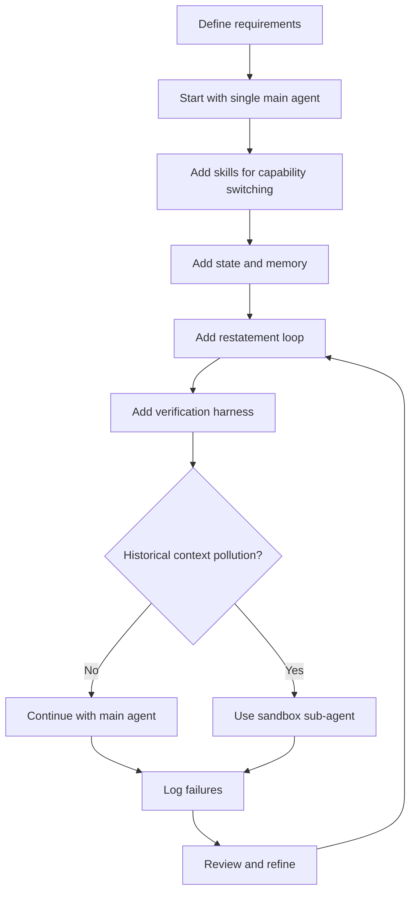

# AI Agent 工程实践 SOP

## 适用范围

本 SOP 适用于需要构建、改造或排查 AI Agent 的项目，尤其适合以下场景：

- Agent 需要完成多步骤任务。
- Agent 需要调用工具、写代码、生成内容或做长周期工作。
- 系统出现跳步、忘规则、上下文丢失、输出重复、成本过高等问题。
- 团队不确定应该使用单 Agent、Sub-agent、Skill、Memory 还是 Restatement。

## SOP 总目标

用工程化流程保证 Agent 系统具备：

- 可观察：能看到每一步为什么这样做。
- 可控制：关键规则不会只靠模型自觉。
- 可验证：每一步都有明确验收标准。
- 可迭代：失败后能定位原因，而不是盲目换框架。
- 可交接：架构、规则、Prompt、日志和决策能被后来的人理解。

## 角色分工

| 角色 | 职责 |
| --- | --- |
| 产品 / 业务负责人 | 定义目标、成功标准、不可接受结果 |
| Agent 架构负责人 | 决定单 Agent、Skill、Sub-agent、Memory 等架构边界 |
| Prompt / Context 负责人 | 设计 System Prompt、Skill、Restatement、上下文裁剪 |
| 工程负责人 | 实现工具调用、状态管理、日志、验证和重试 |
| 测试 / 验收负责人 | 维护测试用例、失败分类和回归检查 |

小团队可以一人多职，但文档中仍要把职责写清楚。

## 阶段 0：任务定界

### 目标

先判断系统真正要解决什么问题，避免一开始就套用热门 Agent 架构。

### 输入

- 用户需求。
- 业务目标。
- 当前系统问题。
- 可接受的成本和延迟范围。

### 操作步骤

1. 写清楚 Agent 的最终产出是什么。
2. 写清楚 Agent 必须遵守的硬规则。
3. 写清楚哪些事情允许模型自由发挥。
4. 写清楚哪些错误绝对不能发生。
5. 判断任务是短任务还是长任务。

### 输出文档

建议创建 `AGENT_REQUIREMENTS.md`，至少包含：

```markdown
# Agent Requirements

## Goal

## Non-goals

## Inputs

## Outputs

## Hard Rules

## Flexible Areas

## Failure Cases We Must Avoid

## Acceptance Criteria
```

### 检查清单

- [ ] 是否明确最终输出格式？
- [ ] 是否明确不可接受行为？
- [ ] 是否明确任务长度和步骤数量？
- [ ] 是否明确哪些信息是长期规则，哪些是阶段信息？
- [ ] 是否明确成本、速度、质量的优先级？

## 阶段 1：选择最小可行架构

### 目标

先从最简单的架构开始，不为了“高级感”引入多 Agent。

### 默认建议

优先从以下结构开始：

```text
Single Main Agent
+ Stable System Prompt
+ Skill Injection
+ Step-level Verification
+ Logs
```

不要一开始就默认使用多 Sub-agent。

### 决策规则

| 问题 | 优先方案 |
| --- | --- |
| 只是不同阶段要遵守不同规则 | Skill |
| 需要长期保持步骤纪律 | Restatement |
| 需要记住任务状态 | Memory / State |
| 需要检查结果是否合格 | Harness / Verification |
| 历史内容会污染当前生成 | Sandbox Sub-agent |
| 多 Agent 信息不同步 | 减少 Sub-agent 或加强 Context Alignment |

### 输出文档

建议创建 `AGENT_ARCHITECTURE.md`：

```markdown
# Agent Architecture

## Current Architecture

## Why This Architecture

## Why Not Multi-agent By Default

## Skills

## Memory / State

## Verification

## When To Use Sub-agent
```

## 阶段 2：设计 Prompt 动静分离

### 目标

避免频繁修改 System Prompt，同时保证关键规则始终容易被模型看到。

### 分类规则

| 信息类型 | 放置位置 | 示例 |
| --- | --- | --- |
| 长期不变的硬规则 | System Prompt | 不跳步骤、输出 JSON、禁止删除用户文件 |
| 当前任务进度 | 最新用户/系统消息 | 当前是第 7 步，下一步只做第 8 步 |
| 当前阶段 Skill | 最新消息 | 现在使用代码审查 Skill |
| 临时素材 | 当前任务上下文 | 当前图片、当前文件片段、当前测试日志 |
| 历史总结 | Memory 摘要 | 上一阶段决策、已完成模块 |

### 操作步骤

1. 把所有规则列出来。
2. 标记每条规则是静态还是动态。
3. 静态规则进入 System Prompt。
4. 动态规则进入 Restatement 或当前任务消息。
5. 不要为了更新当前进度而改 System Prompt。

### 检查清单

- [ ] System Prompt 是否只包含长期稳定规则？
- [ ] 当前进度是否放在最近上下文？
- [ ] 当前 Skill 是否只在需要时注入？
- [ ] 是否避免频繁修改 System Prompt？
- [ ] 是否有一份规则清单方便维护？

## 阶段 3：建立 Skill 机制

### 目标

让同一个 Agent 在不同阶段切换工作方式，而不是为每种能力创建一个 Sub-agent。

### Skill 文档模板

每个 Skill 建议写成独立文件：

```markdown
# Skill: <Name>

## When To Use

## Inputs Required

## Procedure

## Output Format

## Quality Checklist

## Common Failure Cases
```

### Skill 设计原则

1. Skill 应该描述操作流程，不只是写一堆抽象原则。
2. Skill 必须说明适用场景，避免被错误触发。
3. Skill 要有输入要求，否则 Agent 会在信息不足时乱做。
4. Skill 要有输出格式，方便后续验证。
5. Skill 不应包含大量与当前任务无关的背景知识。

### 什么时候不要用 Skill

- 当前任务需要完全独立的上下文。
- 当前任务需要多候选方案互不影响。
- 当前任务风险高，需要隔离执行。
- 当前任务的历史背景会造成明显误导。

## 阶段 4：建立状态与 Memory

### 目标

让 Agent 有稳定的任务状态，但不误以为“写入 Memory 就万事大吉”。

### 状态至少包含

```json
{
  "task_id": "example",
  "current_step": 3,
  "completed_steps": [1, 2],
  "next_step": 4,
  "active_rules": [],
  "known_decisions": [],
  "open_questions": [],
  "last_verification_result": "pass"
}
```

### 操作步骤

1. 每完成一步，更新状态。
2. 每开始一步，从状态生成 Restatement。
3. 每次失败，记录失败类型。
4. 定期把长历史压缩成结构化摘要。
5. 不要把完整历史无脑塞回上下文。

### 检查清单

- [ ] 当前步骤是否明确？
- [ ] 已完成步骤是否可追踪？
- [ ] 下一步是否唯一？
- [ ] 决策是否有记录？
- [ ] 失败是否有分类？
- [ ] Memory 是否会被召回到最近上下文？

## 阶段 5：建立 Restatement 循环

### 目标

在长任务中持续把关键规则、当前进度和下一步目标拉回最近上下文。

### Restatement 模板

```text
当前状态：
- 已完成：<completed_steps>
- 当前步骤：<current_step>
- 下一步只允许做：<next_step>

本步骤目标：
- <goal>

必须遵守：
- <rule_1>
- <rule_2>
- <rule_3>

禁止：
- 不要跳到后续步骤。
- 不要合并多个未授权步骤。
- 不要修改与当前步骤无关的内容。

输出要求：
- <format>

验收标准：
- <check_1>
- <check_2>
```

### 使用频率

| 场景 | Restatement 频率 |
| --- | --- |
| 3 步以内短任务 | 可选 |
| 5-20 步中等任务 | 每个关键步骤前 |
| 20 步以上长任务 | 每一步前都要轻量重申 |
| 高风险操作 | 操作前和操作后都要重申 / 验证 |

### 检查清单

- [ ] 是否明确只做下一步？
- [ ] 是否禁止跳步和合并步骤？
- [ ] 是否包含当前阶段规则？
- [ ] 是否包含验收标准？
- [ ] 是否避免过长、无关的重申？

## 阶段 6：建立验证 Harness

### 目标

不要只相信 Agent 自己说“完成了”，要用规则或工具验证。

### 验证类型

| 类型 | 示例 |
| --- | --- |
| 格式验证 | JSON Schema、Markdown 结构、字段完整性 |
| 静态检查 | lint、typecheck、文件存在性 |
| 行为验证 | 单元测试、集成测试、脚本运行 |
| 语义验证 | 是否满足业务规则、是否遗漏关键点 |
| 安全验证 | 是否越权、是否修改无关文件 |

### 操作步骤

1. 每个步骤定义验收标准。
2. Agent 输出后立即验证。
3. 验证失败时，不直接进入下一步。
4. 失败修复时只修当前步骤。
5. 验证结果写入状态。

### 失败分类建议

```text
FORMAT_ERROR
MISSING_REQUIREMENT
STEP_SKIPPED
RULE_VIOLATION
TOOL_FAILURE
CONTEXT_LOSS
CONTEXT_POLLUTION
LOW_QUALITY_REPETITION
```

## 阶段 7：判断是否需要 Sandbox Sub-agent

### 目标

只在确实需要上下文隔离时使用 Sub-agent，避免回到臃肿的多 Agent 架构。

### 触发条件

满足以下任一情况，可以考虑使用 Sandbox Sub-agent：

- 当前输出明显被历史样例影响。
- 需要多个独立创意方案。
- 当前任务只需要少量上下文，不需要完整历史。
- 历史代码或历史决策会误导当前任务。
- 需要隔离风险或做一次性探索。

### Sub-agent 输入原则

只传必要信息：

```text
1. 当前任务目标
2. 必须遵守的规则
3. 当前输入材料
4. 输出格式
5. 验收标准
```

不要传：

```text
1. 大量历史代码
2. 与当前任务无关的聊天记录
3. 过期决策
4. 容易诱导模仿的旧样例
5. 未经整理的完整日志
```

### Sub-agent 输出要求

Sub-agent 返回结果时，应包含：

- 实际输出。
- 使用了哪些输入。
- 没有处理哪些内容。
- 自检结果。
- 需要主 Agent 决策的问题。

## 阶段 8：日志与复盘

### 目标

让每次 Agent 失败都能沉淀成下一次改进依据。

### 必须记录

```markdown
## Step Log

- Step:
- Input:
- Active Skill:
- Restatement:
- Output:
- Verification:
- Failure Type:
- Fix:
- Decision:
```

### 每次问题后要问

1. 模型是没看到关键信息，还是看到了太多干扰信息？
2. 问题发生在任务前期、中期还是后期？
3. 是规则写得不清楚，还是规则位置不对？
4. 是需要 Skill，还是需要 Sub-agent？
5. 是需要更多上下文，还是需要更少上下文？
6. 是否有验证机制提前发现问题？

## 阶段 9：交接与文档沉淀

### 目标

让后续维护者不用重新踩坑。

### 必备文档

| 文档 | 用途 |
| --- | --- |
| `AGENT_REQUIREMENTS.md` | 需求、边界、验收标准 |
| `AGENT_ARCHITECTURE.md` | 当前架构和设计原因 |
| `SKILLS/` | 每个 Skill 的触发条件和流程 |
| `PROMPT_RULES.md` | 静态规则和动态规则清单 |
| `FAILURE_LOG.md` | 失败案例和修复记录 |
| `HANDOFF.md` | 当前进展、关键决策、下一步 |

### Handoff 模板

```markdown
# Agent Project Handoff

## Current Goal

## Current Architecture

## Key Decisions

## Active Skills

## Static Rules

## Dynamic State

## Known Failure Cases

## Verification Commands

## Next Steps

## Risks
```

## 快速诊断表

| 症状 | 可能原因 | 优先处理 |
| --- | --- | --- |
| Agent 经常跳步骤 | 当前步骤没有被放到最近上下文 | 加 Restatement |
| Agent 忘记规则 | 规则被埋在长历史中 | 规则动静分离，关键规则前置或重申 |
| Agent 输出越来越像 | 历史输出污染当前生成 | 使用 Sandbox Sub-agent |
| Agent 变慢变贵 | 架构链路过长或频繁改 System Prompt | 减少 Sub-agent，稳定 System Prompt |
| 多 Agent 理解不一致 | Context Alignment 失败 | 合并为单 Agent + Skill |
| 修复一个问题引入另一个问题 | 没有步骤级验证 | 增加 Harness 和回归用例 |
| 日志看不出原因 | 缺少输入、规则、输出记录 | 建立 Step Log |

## 推荐落地流程



## 最小可用版本建议

如果时间有限，至少做到以下 6 件事：

1. 写清楚 Agent 的目标、非目标和验收标准。
2. 默认使用单 Agent，不一开始就拆多个 Sub-agent。
3. 把长期规则和动态进度分开。
4. 每个关键步骤前做 Restatement。
5. 每步输出后做验证。
6. 只有在历史上下文污染当前任务时，才启用 Sandbox Sub-agent。

## SOP 结论

Agent 工程的关键不是选择某个流行框架，而是建立一套可观察、可验证、可迭代的工作流程。

正确顺序是：

```text
先看失败模式 -> 再定上下文策略 -> 再选架构组件 -> 最后做验证和沉淀
```

不要为了使用 Sub-agent 而使用 Sub-agent，也不要为了追求简洁而拒绝 Sub-agent。

真正的判断标准只有一个：当前系统的真实痛点，是否需要它。

