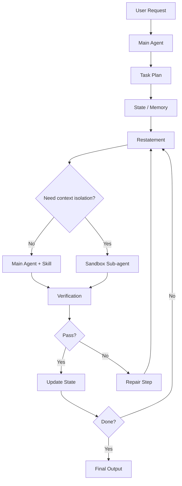

# AI Agent 架构演进架构复盘版

## 复盘目的

本文档将原文整理为一次架构复盘，重点回答四个问题：

1. 初始架构为什么看起来合理，却在真实工程中失效？
2. 每次重构到底解决了什么问题，又引入了什么新边界？
3. 哪些结论可以沉淀为后续 Agent 项目的架构决策原则？
4. 如果团队以后要做类似系统，应该怎样复用这些经验？

## 背景

项目目标是构建一个用于生成讲解视频动画效果的 AI Agent。该系统不是一次性短问答，而是需要连续规划、生成、验证和迭代的复杂 Agent 流程。

早期目标包括：

- 能理解用户输入。
- 能拆解任务。
- 能生成多段代码或动画效果。
- 能在长周期任务中保持质量稳定。
- 能在复杂任务中减少人工干预。

## 核心矛盾

这个项目的核心矛盾不是“Agent 会不会调用工具”，而是：

> 如何在长任务中同时保持上下文连续、规则稳定、成本可控和输出多样性。

这四个目标彼此有冲突：

| 目标 | 需要什么 | 可能带来的副作用 |
| --- | --- | --- |
| 上下文连续 | 尽量让同一个 Agent 持续工作 | 历史内容过多，导致输出同质化 |
| 规则稳定 | 重复强调关键规则 | 增加 Token 成本 |
| 成本可控 | 减少重复计算和通信 | 可能牺牲隔离性 |
| 输出多样性 | 给模型干净空间独立生成 | 可能损失完整历史背景 |

## 时间线总览

| 阶段 | 架构选择 | 触发原因 | 结果 |
| --- | --- | --- | --- |
| V1 | Plan and Execute + 多 Sub-agent | 希望职责清晰、结构严谨 | 结构臃肿，小改动成本高，主 Agent 越权 |
| V2 | 单 Agent + Skill 注入 | 降低通信成本，保持上下文连续 | 短任务效果提升，Token 成本下降 |
| V2.5 | 单 Agent + To-Do List / Memory | 支撑长运行任务 | 中后期出现赶工、规则失效、同质化 |
| V3 | Restatement + Prompt 动静分离 | 对抗注意力衰退，兼顾 KV Cache | 规则稳定性提升，跳步减少 |
| V4 | 主 Agent + 沙盒 Sub-agent | 解决历史上下文污染和输出同质化 | Sub-agent 以“上下文隔离”身份回归 |

## V1 复盘：Plan and Execute 的工程陷阱

### 当时的设计假设

团队最初采用经典的 Plan and Execute 思路：

- 主 Agent 负责规划、调度和拆解。
- Design Sub-agent 负责设计。
- Coding Sub-agent 负责编码。
- 各角色边界通过 System Prompt 约束。

这个设计在架构图上非常清晰，也符合传统软件工程的模块化直觉。

### 实际问题

#### 问题 1：小改动成本过高

用户只是要求改一行代码，系统仍然要经历：

1. 主 Agent 理解需求。
2. 主 Agent 制定计划。
3. 主 Agent 分发任务。
4. 子 Agent 执行。
5. 结果回传。
6. 主 Agent 汇总。

这导致响应慢、Token 消耗高、链路过长。

#### 问题 2：主 Agent 越权

虽然 Prompt 规定主 Agent 只负责编排，但它仍然经常直接写代码。

这说明：

- Prompt 约束不是硬隔离。
- LLM 会根据上下文概率生成“看起来有帮助”的内容。
- 传统软件工程的职责边界不能简单迁移到自然语言 Agent。

### 复盘结论

Plan and Execute 可以作为一种工作流程，但不应默认被实现为物理多 Agent 架构。

架构判断标准不应该是“分层是否清楚”，而应该是：

- 是否减少真实任务成本。
- 是否降低错误传播。
- 是否让上下文更容易保持一致。
- 是否便于验证和调试。

## V2 复盘：Skill 注入与架构扁平化

### 重构动作

团队将原本放在 Design Sub-agent 和 Coding Sub-agent 里的规则，转化为 Skill，并在需要时注入给主 Agent。

变化如下：

| 原设计 | 新设计 |
| --- | --- |
| 不同能力由不同 Sub-agent 执行 | 不同能力由 Skill 注入给同一个 Agent |
| 主 Agent 与子 Agent 之间传递上下文 | 当前 Agent 保留完整上下文 |
| 通信层复杂 | 通信层减少 |

### 观察结果

- 复杂任务表现没有下降，反而提升。
- Token 开销下降。
- 上下文丢失问题减少。
- 开发和调试链路更短。

### 原因分析

多 Agent 架构最大的隐藏成本是 Context Alignment。

当多个 Agent 协作时，系统必须回答：

- 子 Agent 是否看到了完整的用户输入？
- 子 Agent 是否看到了主 Agent 的真实意图？
- 图片、文件、搜索结果、历史决策是否完整传递？
- 子 Agent 的输出是否被主 Agent 正确理解？

如果这些问题没有被精确解决，多 Agent 会放大误差。

### 复盘结论

Skill 适合解决“能力切换”问题。

当任务需要的是同一个 Agent 在不同阶段遵守不同规则时，Skill 通常比 Sub-agent 更轻、更稳、更省。

## V2.5 复盘：长任务暴露的新问题

### 新场景

短 Demo 成功后，系统进入真实长任务：

- 连续生成上百段代码。
- 长时间保持风格和质量。
- 按步骤推进。
- 避免中途失控。

### 采取的措施

引入 Memory System、To-Do List 和验证机制，希望 Agent 能记住：

- 当前做到了哪一步。
- 后面还有哪些步骤。
- 每一步必须遵守什么规则。

### 实际失败模式

#### 失败模式 1：步骤合并和跳过

任务前期还能逐步执行，中后期开始一次性合并多个步骤，表现出明显赶工倾向。

#### 失败模式 2：规则失效

早期注入的 Skill 和约束逐渐被忽略，模型不再稳定遵守规则。

#### 失败模式 3：输出同质化

后续生成越来越像前文复制，缺少独立思考和局部创新。

### 根因分析

根因不是 Memory 不够强，而是模型对长上下文的注意力分配不均。

大模型通常更关注：

- 最前面的 System Prompt。
- 最近的上下文。

而中间的大量历史内容会被弱化。早期 To-Do List 和规则没有消失，但它们不再处于高注意力区域。

### 复盘结论

Memory 不是“写进去就会一直有效”。

长任务中，记忆必须被持续召回、重申和验证，否则它只是上下文中一段越来越不显眼的文本。

## V3 复盘：Restatement 与动静分离 Prompt

### 重构动作

引入 Restatement，在执行循环中周期性重申：

- 已完成什么。
- 当前要做什么。
- 下一步不能跳过什么。
- 当前阶段必须遵守哪些规则。
- 输出需要满足什么格式。

同时引入 Prompt 动静分离：

| 类型 | 放置位置 | 原因 |
| --- | --- | --- |
| 静态规则 | System Prompt | 长期不变，享受稳定高优先级 |
| 动态进度 | 最新消息 | 经常变化，避免修改 System Prompt |
| 阶段性 Skill | 最新消息或当前任务块 | 只对当前阶段有效 |
| 验收标准 | 当前步骤附近 | 让模型在输出前能直接看到 |

### 为什么不能频繁改 System Prompt

从 KV Cache 角度看，修改 System Prompt 会让后续缓存失效，增加推理成本和延迟。

因此：

- 长期不变的规则应稳定放在 System Prompt。
- 经常变化的信息不要写回 System Prompt。
- 动态信息应追加在最近上下文中。

### 改进效果

Restatement 有助于：

- 减少跳步。
- 减少中后期规则遗忘。
- 提高格式稳定性。
- 让长任务更可控。

### 仍未解决的问题

输出同质化仍然存在。

原因是单一 Agent 长时间看到自己之前生成的大量内容，会倾向于模仿过去的写法。

### 复盘结论

Restatement 解决的是“该看的信息没有被看到”。

但它解决不了“看到了太多不该看的历史内容”。

## V4 复盘：Sub-agent 以 Context Isolation 回归

### 新判断

Sub-agent 并非一定错误。错误的是为了职责分层而机械拆分 Sub-agent。

当问题变成历史上下文污染时，Sub-agent 的价值重新出现：

> 它可以提供干净、独立、物理隔离的上下文空间。

### 新架构形态

主 Agent 负责：

- 全局目标。
- 总体计划。
- 状态记录。
- Restatement。
- 验收和汇总。

沙盒 Sub-agent 负责：

- 在干净上下文中执行当前具体任务。
- 只接收必要规则、当前输入和验收标准。
- 不读取大量历史代码。
- 返回候选结果。

### 与第一代 Sub-agent 的区别

| 维度 | 第一代 Sub-agent | 最终形态 Sub-agent |
| --- | --- | --- |
| 引入原因 | 职责分层 | 上下文隔离 |
| 主要价值 | 看起来模块化 | 避免历史污染 |
| 上下文 | 尽量传完整 | 只传必要信息 |
| 风险 | 通信复杂、上下文丢失 | 需要选择正确的上下文切片 |
| 适用场景 | 被过度泛化 | 用于明确需要隔离的任务 |

### 复盘结论

同一个组件在不同架构阶段可能有完全不同的意义。

Sub-agent 的正确使用方式不是“让架构更像组织架构”，而是“控制模型能看到什么、不能看到什么”。

## 架构原则沉淀

### 原则 1：先定位失败模式，再选择架构组件

不要先问“要不要多 Agent”，而要先问：

- 当前主要失败是上下文丢失吗？
- 是规则遗忘吗？
- 是历史污染吗？
- 是工具调用不稳定吗？
- 是验证不足吗？

不同失败模式对应不同解法。

### 原则 2：Skill 解决能力切换，Sub-agent 解决上下文隔离

如果只是需要换一套规则，优先用 Skill。

如果需要切断历史干扰，再考虑 Sub-agent。

### 原则 3：Memory 必须配合召回机制

Memory 不能只写入，还要设计：

- 何时召回。
- 召回多少。
- 放在上下文哪里。
- 如何验证模型真的遵守了它。

### 原则 4：长任务要把规则放回最近上下文

任务越长，越不能只依赖开头的说明。

每个关键步骤都应该有轻量 Restatement。

### 原则 5：上下文不是越多越好

Agent 看到的信息越多，不一定效果越好。

上下文设计要同时考虑：

- 必须看到什么。
- 不该看到什么。
- 哪些信息只在当前阶段有效。
- 哪些信息会造成误导和模仿。

## 可复用架构模板

### 推荐默认架构

### 架构决策表

| 现象 | 优先检查 | 建议动作 |
| --- | --- | --- |
| Agent 跳步骤 | 最近上下文是否有当前步骤和规则 | 加 Restatement |
| Agent 忘规则 | 规则是否被埋在中间历史 | 把关键规则移到 System Prompt 或最近消息 |
| Agent 输出重复 | 是否看到了太多历史样例 | 用沙盒 Sub-agent 隔离上下文 |
| 多 Agent 配合差 | 上下文传递是否完整 | 减少 Sub-agent，改用 Skill |
| 成本和延迟高 | 是否频繁改 System Prompt | 做 Prompt 动静分离 |
| 调试困难 | 是否缺少日志和验收点 | 增加步骤级日志、检查点、失败分类 |

## 后续改进建议

1. 建立 Agent 运行日志规范，记录每一步输入、输出、规则和验收结果。
2. 为失败类型建立分类，例如跳步、格式错误、工具失败、上下文污染、规则遗忘。
3. 为每个 Skill 编写适用场景、输入要求、输出格式和验收标准。
4. 对长任务建立 Restatement 模板，避免每次手写。
5. 对 Sub-agent 建立上下文裁剪规则，明确哪些历史不能传入。
6. 建立小规模控制变量实验，用真实日志验证架构调整是否有效。

## 最终复盘结论

这次架构演进的关键不是从多 Agent 变成单 Agent，再从单 Agent 回到多 Agent。

真正的关键是团队对 Agent 架构的理解发生了变化：

- 早期关注“模块怎么分”。
- 中期关注“上下文怎么连续”。
- 后期关注“上下文怎么选择和隔离”。

Agent 工程的核心能力，不是拼接热门概念，而是持续观察真实失败模式，并用最小必要架构去修复它。

